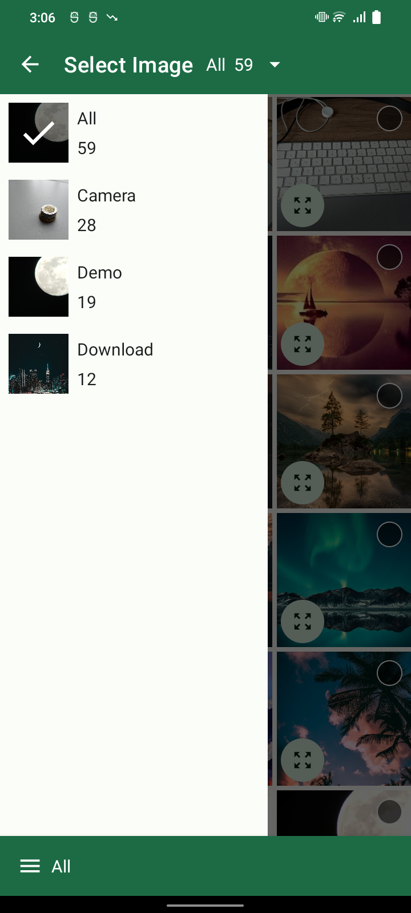

# TedImagePicker Material 3 & Fresco [](https://jitpack.io/#martinmzrz/TedImagePickerMaterial3)

Modification of the library "TedImagePicker" compatible with Material3 and Fresco. The use is similar, the changes are only in view

|       Image Select       |         Select Album         |
|:------------------------:|:----------------------------:|
|  |  |

</br></br>

## How to use
Add it in your root build.gradle at the end of repositories:

```groovy
allprojects {
    repositories {
        ...
        maven { url "https://jitpack.io" }
    }
}
```
Add to your dependencies:
```groovy
dependencies {
  implementation 'com.github.martinmzrz:TedImagePickerMaterial3:{Tag}'
}
```

Don't forget to initialize the Fresco library
```kotlin
class MyApplication : Application() {

  override fun onCreate() {
    super.onCreate()

    Fresco.initialize(this)
    ...
  }

}
```